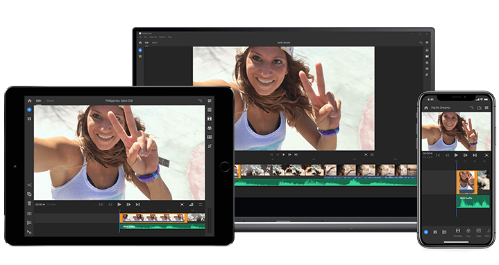

# Get Premiere Rush for mobile.

---

&nbsp;

---

#### Text yourself a link to the app store to get the Premiere Rush mobile app.

<link rel="stylesheet" type="text/css" href="//d22hhoe037sl7u.cloudfront.net/1.7/css/link_texting_gz.min.css">

   

       

           

           

               <input type="hidden" class="linkID" value="f49c5625-074d-4740-b96d-ee2cd28301a4">
               

                   <input class="linkTextingInput linkTextingInputFlagAdjust" type="tel" id="numberToText_linkTexting">
               

               <button class="linkTextingButton localized-button localized-text-text_me_a_link" type="button" id="sendButton_linkTexting" style="background-color: #1473E6;color : #ffffff">TEXT ME A LINK</button>
               

           

       

   

Message and data rates may apply. Adobe does not store or share your mobile phone number.

Coming soon on Android.

